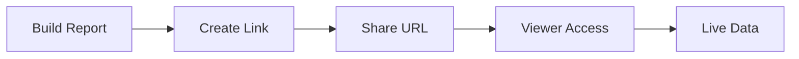

## Overview

Mind Dump provides powerful tools for capturing thoughts, organizing tasks, and generating insights. You can quickly add tasks via direct input or structured forms, customize card layouts for better visibility, build flexible reports with sorting and filters, and create mixed views or shareable links for collaboration.

<Columns cols={2}>
  <Card title="Task Entry" icon="plus" href="#task-entry">
    Capture ideas instantly with direct input or detailed forms.
  </Card>
  <Card title="Custom Layouts" icon="settings" href="#custom-layouts">
    Reorder fields and tweak interactions for your workflow.
  </Card>
  <Card title="Report Builder" icon="bar-chart" href="#report-builder">
    Display, sort, group, and filter tasks dynamically.
  </Card>
  <Card title="Mixed Views & Sharing" icon="share-2" href="#mixed-views">
    Combine views and generate public links securely.
  </Card>
</Columns>

## Task Entry and Direct Input

Add tasks efficiently using two primary methods: quick direct input for rapid capture or the full form for detailed entries.

<Tabs>
  <Tab title="Direct Input" icon="zap">
    Use the scratch pad for immediate thoughts.
    
    1. Type your idea in the input field.
    2. Click **Send to Mind Dump**.
    
    <Callout kind="tip">
      Direct input auto-detects due dates like "tomorrow" based on your timezone.
    </Callout>
  </Tab>
  
  <Tab title="Add New Task Form" icon="plus-circle">
    <Steps>
      <Step title="Open Form" icon="edit-3">
        Click **Add Task** or press <kbd>Ctrl</kbd>+<kbd>N</kbd>.
      </Step>
      
      <Step title="Fill Details" icon="list">
        Enter task name, description, due date, and tags.
        
````json
{
  "name": "Review quarterly reports",
  "due": "2024-12-31",
  "priority": "high",
  "tags": ["finance", "urgent"]
}
````
      </Step>
      
      <Step title="Save" icon="check-circle">
        Click **Add Task** to store it.
      </Step>
    </Steps>
  </Tab>
</Tabs>

## Custom Card Layouts and Interactions

Tailor task cards to your needs by toggling fields, reordering them, and adjusting hover behaviors.

<Expandable title="Available Fields" default-open="true">
  Drag fields like **Task Name**, **Due Date**, **Priority**, and **Tags** to customize the layout. Toggle visibility for a clutter-free view.
  
  | Field       | Description                  | Default Visible |
  |-------------|------------------------------|-----------------|
  | Task Name  | Primary task identifier     | Yes            |
  | Due Date   | Scheduled completion        | Yes            |
  | Priority   | High/Medium/Low levels      | Yes            |
  | Tags       | Categorization labels       | No             |
  | Assignee   | Team member responsible     | No             |
</Expandable>

<Callout kind="info">
  Set **Menu Expansion Delay** to `300ms` (recommended) for smooth hover interactions without accidental opens.
</Callout>

## Report Builder

Create custom reports to analyze your tasks effectively.

<Steps>
  <Step title="Select Fields" icon="list">
    Drag to reorder display fields. **Task Name** always appears first.
  </Step>
  
  <Step title="Configure Sorting" icon="arrow-up-down">
    Set **Primary Sort** (e.g., Due Date ascending) and **Secondary Sort** (e.g., Priority descending).
  </Step>
  
  <Step title="Apply Grouping & Filters" icon="filter">
    Group by **Assignee** or **Status**. Add rules like "Priority > Medium" and "Status != Completed".
    
    <Expandable title="Example Filter Rules">
      - Due Date `<` today + 7 days
      - Tags contains "urgent"
      - Priority = "high"
    </Expandable>
  </Step>
  
  <Step title="Generate & Save" icon="save">
    Click **Generate Report** or **Save Template** for reuse.
  </Step>
</Steps>

## Mixed Views and Shareable Links

Combine multiple views into one or share reports publicly.

### Creating Mixed Views
Use **Create a Mixed View** to merge task lists, reports, and calendars. Confirm with **Show Combined View**.

### Shareable Links
<Callout kind="alert" title="Security Warning">
  Shareable links are public. Avoid sensitive data like personal details or confidential tasks.
</Callout>

1. Build your report.
2. Click **Create a Shareable Link**.
3. Copy the generated URL (e.g., `https://minddump.uk/share/report-abc123`).

Anyone with the link views the live data. Revoke by editing the report.



These features make Mind Dump versatile for solo or team use. Explore [quickstart](/quickstart) for setup.